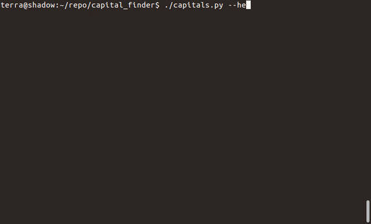

# Capitals
Displays capital city of any country. `capitals` requires nothing more than
a standard Python 3 installation.

## Installation
TODO: Add installation instructions

## Usage

This program can be imported into other Python programs or run from the
commandline.


### Running it from the commandline.
There are two ways to run `capitals.py`.

1. `python capitals.py` OR
2. Run it as an executable. On Unix based systems do:
`$ chmod +x capitals.py`
And then do:
`$ ./capitals.py <country name>`

For detailed help information:
```bash
 $ ./capitals.py --help

usage: capitals [country]

Displays capital city of specified country.

positional arguments:
  country     Displays the capital of country.

optional arguments:
  -h, --help  show this help message and exit
```

### Importing capitals.py into your own Python programs
To use the program as a module, import `capitals` into your code.
Call the `capitals.capital()` function and pass a country to it as an argument.
The `capital()` function will return the capital of that country or a 0 if an invalid
country was passed to it. Capitalisation does not matter.

``` python
>>> capitals.capital("Wakanda")
0
>>> capitals.capital("Germany")
'Berlin'
>>> capitals.capital("Japan")
'Tokyo'
>>> capitals.capital("North Korea")
'Pyongyang'
>>> capitals.capital("lithuania")
'Vilnius'
```

## Contributing
1. Fork it!
2. Create your feature branch: `git checkout -b my-new-feature`
3. Commit your changes: `git commit -am 'Add some feature'`
4. Push to the branch: `git push origin my-new-feature`
5. Submit a pull request :D

## License
The License is [here](LICENSE.txt)
